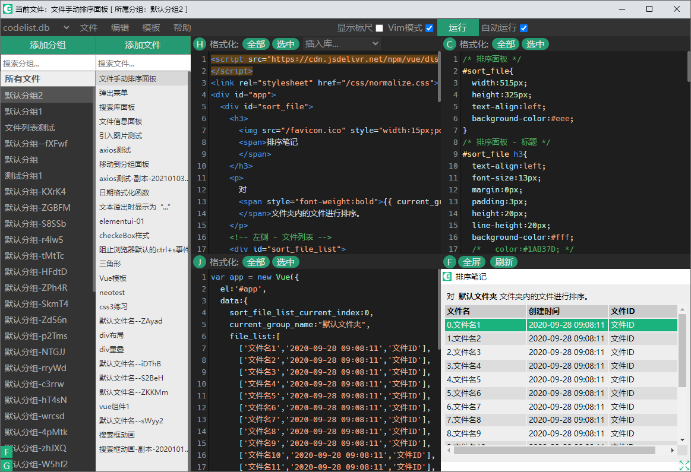
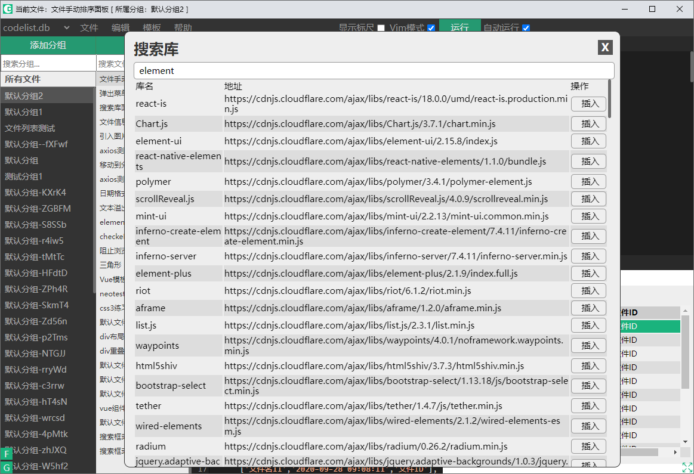

# readme

## 启动方式

1. `cmd`运行`enter_env.bat`

2. 执行 python3 index.py 命令

## 截图





## 已知 Bug

### 电脑进入睡眠模式，再启动的时候，程序会出问题

`eel`这个库本身的问题。

## 重要说明

### 循环问题

**问题**：如果写了死循环，并且勾选了自动运行的话，会卡死。

**解决方法**：卡死之后，直接关闭软件重新打开，**不**勾选自动运行,再切换到写了死循环的文件，修改之后，再勾选回自动运行。

**防止卡死**：写循环之前，先取消勾选自动运行。

## 引入资源

必须在`neo_web`文件夹里面新建文件夹来放自己的资源。如果引用的文件不在`neo_web`文件夹里面的话，会无效。
但是，只要是在`neo_web`文件夹里面的话，可以随意新建文件夹来放自己的资源。

以下是实例：

### css

```html
<link rel="stylesheet" href="/css/neo.css" />
```

### 图片

```html

```

## 快捷键

### 代码编辑框全屏 F11

当编辑框处于激活状态的时候，按`F11`会把代码框全屏。再按`F11`或者`Esc`会取消全屏。
